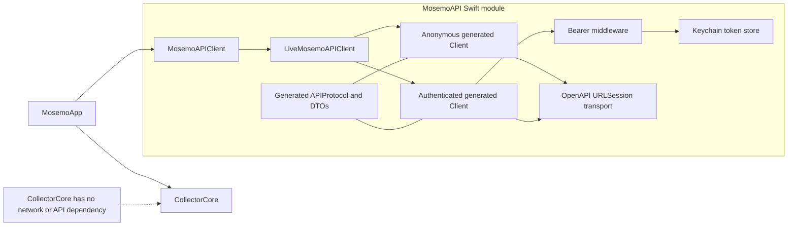
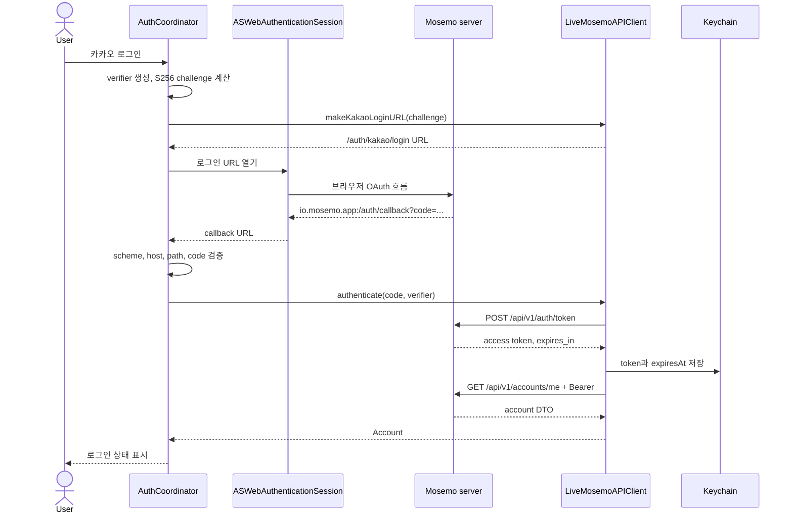

# macOS OpenAPI·인증 아키텍처

이 문서는 서버가 제공한 OpenAPI artifact를 Mosemo macOS 앱에서 사용하는
구조와 Kakao 로그인 경계를 설명한다. 서버 계약의 설계·변경·배포는 이 저장소의
범위가 아니며, `Sources/MosemoAPI/openapi.json`을 확정된 입력으로 취급한다.

관련 결정의 배경은 다음 ADR에 보존한다.

- [ADR-0001: OpenAPI 생성 코드를 MosemoAPI 내부에 둔다](adr/0001-keep-generated-openapi-inside-mosemo-api.md)
- [ADR-0002: 브라우저 OAuth와 generated API 호출을 분리한다](adr/0002-separate-browser-oauth-from-generated-api.md)

## 목표와 범위

이번 설계의 목표는 다음 세 가지다.

1. `CollectorCore`가 서버·전송 기술을 모르는 수집 도메인으로 남는다.
2. OpenAPI 생성 코드는 앱 전체에 노출하지 않고 손으로 작성한 API 경계 뒤에 둔다.
3. 브라우저 OAuth, 일회용 코드 교환, Bearer 인증과 자격 증명 보관의 책임을
   분리한다.

현재 서버 통신 범위는 Kakao 로그인 시작, access token 교환, 현재 계정 조회뿐이다.
활동 이벤트 전송과 로컬 spool은 아직 구현 범위가 아니다.

## 모듈 구조



SwiftPM이 구조의 단일 기준이다.

| 대상 | 역할 | 의존성 |
| --- | --- | --- |
| `CollectorCore` | 수집 상태와 안전 이벤트를 다루는 순수 도메인 | 없음 |
| `MosemoAPI` | 생성 client, transport, 인증, Keychain, 오류·모델 변환 | OpenAPI runtime, URLSession transport, HTTPTypes |
| `MosemoApp` | SwiftUI/AppKit UI와 `AuthCoordinator` | `CollectorCore`, `MosemoAPI` |

Xcode 프로젝트에는 `Mosemo` 앱 target만 둔다. `CollectorCore`와 `MosemoAPI`는
루트 local package의 library product를 연결하며, 중복 Xcode target과 테스트
target을 만들지 않는다. 패키지 테스트는 `swift test`로 실행한다.

## 공개 API 경계

앱이 의존하는 인터페이스는 다음과 같다.

```swift
public protocol MosemoAPIClient: Sendable {
    func makeKakaoLoginURL(codeChallenge: String) throws -> URL

    func authenticate(
        authorizationCode: String,
        codeVerifier: String
    ) async throws -> Account

    func currentAccount() async throws -> Account
    func signOut() async throws
}
```

모듈 밖에 공개하는 타입은 `MosemoAPIClient`, `LiveMosemoAPIClient`, `Account`,
`AccountProvider`, `MosemoAPIError`와 앱 인증에 필요한 PKCE·callback 처리
타입이다. 생성된 `Client`, `APIProtocol`, `Components.Schemas.*`는
`internal`이며 앱 UI와
`CollectorCore`에서 직접 사용할 수 없다. raw access token도 public API의
반환값이 아니다.

서버 DTO의 account UUID, provider, 생성 시각과 마지막 인증 시각은
`LiveMosemoAPIClient`가 앱의 `Account`로 명시적으로 변환한다. 서버 스키마가
바뀌면 생성 타입을 사용하는 이 변환 경계까지 수정 범위를 제한한다.

## OpenAPI snapshot과 생성 코드

| 항목 | 현재 값 |
| --- | --- |
| 입력 | `Sources/MosemoAPI/openapi.json` |
| 설정 | `Sources/MosemoAPI/openapi-generator-config.yaml` |
| 생성 모드 | `types`, `client` |
| 접근 수준 | `internal` |
| 이름 전략 | `idiomatic` |
| 포함 operation | token 교환, 현재 계정 조회 |
| generator | `1.13.0` |
| runtime | `1.12.0` |
| URLSession transport | `1.3.0` |

브라우저가 소유하는 login/callback endpoint는 생성 operation에서 제외한다.
`/api/v1/auth/kakao/login` URL은 wrapper가 만들고 callback은
`ASWebAuthenticationSession`이 수신한다. 생성 client가 호출하는 endpoint는
`POST /api/v1/auth/token`과 `GET /api/v1/accounts/me`뿐이다.

초기에는 build-tool plugin에서 빌드할 때마다 코드를 생성하려 했다. 실제 Xcode
Debug build에서 plugin 검증 단계가 실패해 command plugin으로 미리 생성한
`GeneratedSources`를 커밋하는 방식으로 전환했다. 일반 Xcode build와 archive는
generator plugin 실행 권한에 의존하지 않는다.

CI는 command plugin을 다시 실행하고 committed `GeneratedSources`와 diff를
비교한다. 루트 `Package.resolved`와 Xcode workspace의 `Package.resolved`를 함께
커밋해 SwiftPM과 Xcode의 의존성 해석을 고정한다.

## Kakao 로그인 흐름



고정 식별자는 다음과 같다.

| 항목 | 값 |
| --- | --- |
| bundle ID | `io.mosemo.app` |
| callback | `io.mosemo.app:/auth/callback` |
| callback scheme | `io.mosemo.app` |
| callback host | 없음 |
| callback path | `/auth/callback` |

`AuthCoordinator`는 `@MainActor`에서 browser session과 화면 상태를 관리한다.
동시에 두 로그인을 시작하지 않으며 두 번째 요청에는 진행 중 상태를 알린다.
`code_verifier`는 파일, UserDefaults, Keychain에 저장하지 않고 로그인 처리 동안
메모리에만 유지한다. 성공, 실패, 취소 후 session과 verifier 참조를 제거한다.

callback은 scheme·host·path가 모두 정확히 일치해야 한다. `code`는 정확히 한
개이며 비어 있지 않아야 한다. `error=access_denied`는 취소, 다른 단일 `error`는
인증 실패로 처리하고 중복 code/error는 잘못된 callback으로 거절한다.

## token과 HTTP 처리

token 교환에는 익명 generated client를, 현재 계정 조회에는 인증 generated
client를 사용한다. 인증 middleware는 매 요청마다 Keychain 값을 읽어 유효기간을
확인하고 `Authorization: Bearer ...` 헤더를 추가한다.

Keychain에는 raw token과 서버의 `expires_in`으로 계산한 `expiresAt`을 함께
저장한다. 만료된 token 또는 `/accounts/me`의 401 응답에서는 Keychain을 비우고
`authenticationRequired`를 반환한다. 로그아웃도 서버 호출 없이 로컬 Keychain
자격 증명을 삭제한다.

초기 버전에는 refresh token이 없다. 따라서 401을 재시도하지 않으며 사용자가
다시 로그인해야 한다. 일회용 authorization code를 사용하는 token 교환도 자동
재시도하지 않는다. 별도 범용 재시도 계층은 두지 않는다.

API용 `URLSession`은 ephemeral configuration을 사용한다. request timeout은
30초, resource timeout은 60초이며 URL cache와 cookie storage를 사용하지 않는다.
OAuth cookie는 API transport가 아니라 시스템 browser session의 책임이다.

## 오류 변환

UI는 HTTP status나 생성 response enum을 직접 판단하지 않는다.

| operation/상황 | 앱 오류 | 추가 처리 |
| --- | --- | --- |
| token 400 | `invalidAuthorizationCode` | 재시도하지 않음 |
| token 422 | `validationFailed` | 재시도하지 않음 |
| account 401 | `authenticationRequired` | Keychain 삭제 |
| 5xx | `serverError(statusCode:)` | 자동 재시도 없음 |
| timeout | `timedOut` | 자동 재시도 없음 |
| 기타 URL 오류 | `networkUnavailable` | 자동 재시도 없음 |
| 예상하지 못한 HTTP 응답 | `unexpectedResponse(statusCode:)` | status 보존 |
| Keychain 실패 | `credentialStorageFailed` | 자격 증명 상태를 성공으로 표시하지 않음 |

형식이 깨진 오류 본문도 서버의 `detail` 문자열에 의존하지 않고 operation과
HTTP status로 분류한다. HTTP 응답을 받기 전에 발생한 알 수 없는 실패는 현재
`unexpectedResponse(statusCode: 0)`으로 표현한다. status `0`은 실제 HTTP
상태가 아니라 “응답 상태 없음”을 뜻하며, 오류 모델을 세분화할 때 별도 case로
교체할 수 있는 알려진 제한이다.

## base URL 설정

`LiveMosemoAPIClient`는 `baseURL`을 생성자로 받으며 `http` 또는 `https` scheme과
host가 있어야 한다.

- Debug Xcode configuration: `http://localhost:8000`
- SwiftPM Debug 실행의 fallback: `http://localhost:8000`
- Release: `MOSEMO_API_BASE_URL` build setting을 `Info.plist`의
  `MosemoAPIBaseURL`로 전달

Release 설정이 비어 있거나 잘못되면 앱을 crash시키지 않고 로그인 UI에 설정
오류를 표시한다. 저장소에는 실제 운영 URL을 하드코딩하지 않는다.

## Privacy 경계

`CollectorCore`에는 network framework와 API DTO가 들어갈 수 없다. 네트워크는
`MosemoAPI`에서만 허용한다. 화면 캡처 API, 데이터베이스, 일반 파일·UserDefaults
영속화, application logging 금지는 production source 전체에 적용한다. 인증
자격 증명 보관을 위한 Keychain만 허용된 영속화 경계다.

access token, callback code, PKCE verifier는 로그와 사용자용 오류 설명에 넣지
않는다. 활동 payload에는 원문 URL·제목·키 입력 내용·클릭 좌표 등의 금지 필드를
추가할 수 없다. 현재 인증 연동은 수집 이벤트를 서버에 전송하지 않는다.

이 경계는 `scripts/check_collector_privacy.sh`에서 정적으로 확인한다.

## OpenAPI 갱신 절차

macOS 저장소는 서버 checkout, tag, 환경 설정이나 OpenAPI 생성 과정에 관여하지
않는다. 전달받은 JSON artifact만 다음 명령에 넘긴다.

```sh
DEVELOPER_DIR=/Applications/Xcode.app/Contents/Developer \
scripts/update_openapi.sh /path/to/exported-openapi.json
```

스크립트는 다음 순서로 동작한다.

1. JSON이 OpenAPI 3.1이며 필수 operation과 200/400/401/422 응답을 포함하는지 확인한다.
2. 기존 snapshot과 `GeneratedSources`를 임시 위치에 백업한다.
3. snapshot을 교체하고 command plugin으로 Swift 코드를 생성한다.
4. `MosemoAPI` target build와 전체 `swift test`를 실행한다.
5. 검증 실패 시 snapshot과 generated source를 이전 상태로 복구한다.

일반 앱 build와 CI는 외부 서버에서 명세를 다운로드하지 않는다.

## 테스트와 완료 기준

`MosemoAPITests`는 실제 네트워크 대신 generated `APIProtocol` fake를 주입한다.
다음 경계를 검증한다.

- token 200·400·422와 account 200·401 매핑
- 형식이 깨진 400·401 본문의 status 기반 처리
- Bearer header 삽입, token 만료와 401 정리, 로그아웃
- Keychain 실제 round trip
- generated account DTO에서 앱 `Account`로의 변환
- RFC 7636 PKCE vector와 무작위 verifier 형식
- login URL과 callback 성공·오류·취소·중복 값 검증
- timeout과 network 오류 변환

CI 완료 조건은 다음과 같다.

```text
OpenAPI 재생성 결과에 diff 없음
→ swift test
→ privacy 검사
→ Xcode Debug build
→ Xcode Release archive
```

2026-09-05 구현 완료 시점에는 42개 Swift test, privacy 검사, Xcode Debug build와
Release archive가 통과했다. 실제 Kakao 계정을 사용하는 end-to-end 로그인은
자동 검증에 포함하지 않았으며
[Kakao 로그인 수동 runtime 검증](AUTH_RUNTIME_CHECKLIST.md)에 별도로 기록한다.

현재 OpenAPI의 `ValidationErrorDetail.ctx`와 `input` nullable schema는 generator가
지원하지 않아 경고와 함께 생략된다. wrapper는 422 본문을 해석하지 않고 status로
매핑하므로 현재 인증 흐름에는 영향을 주지 않지만, snapshot 갱신 때 경고 변화는
확인해야 한다.

## 의도적으로 제외한 것

- 서버 OpenAPI 계약의 작성·배포
- refresh token과 token refresh
- 범용 HTTP 재시도 정책
- 활동 이벤트 업로드, batching, spool, ACK 처리
- `ActivitySyncClient` 빈 인터페이스
- 실제 Kakao 계정이 필요한 자동 end-to-end 테스트

활동 전송 API가 snapshot에 추가되기 전에는 sync abstraction을 미리 만들지 않는다.
추후 구현할 때는 `CollectorCore` 이벤트를 API DTO로 명시적으로 변환하고 event ID,
request idempotency, partial ACK와 재전송 규칙을 먼저 확정해야 한다.
